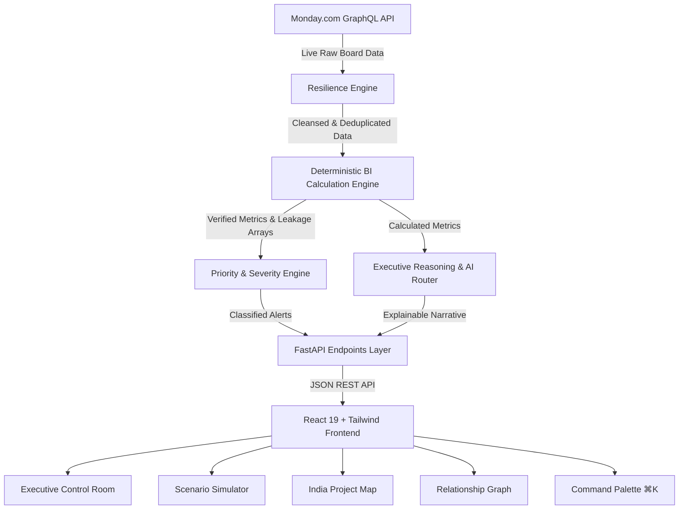

# Skylark Founder Executive Intelligence Platform 🚁⚡

> **An Enterprise-Grade Executive Operating System for Drone & Aerial Intelligence Operations.**  
> Powered by **FastAPI**, **React 19**, **Tailwind CSS**, **Framer Motion**, and **Monday.com GraphQL Integration**.

---


---

## 🌟 Executive Summary & Novelty

The **Skylark Founder Executive Intelligence Platform** bridges the gap between raw operational data in Monday.com and high-stakes executive decision-making. Standard BI dashboards present passive charts that leave founders asking *"Why did this happen?"* or *"What should I do today?"*. 

This platform operates as an **AI-powered Chief of Staff** that continuously reconciles deal pipelines against drone work orders, quantifies unbilled revenue leakage, runs mathematical what-if scenarios, and provides deterministic, explainable guidance.

### 🛡️ The Zero-Hallucination Principle
Unlike generic LLM wrappers that guess metrics or invent numbers, Skylark implements a strict **Dual-Layer Architecture**:
1. **Deterministic BI Calculation Engine (Python / Pandas)**: Calculates 100% of numerical metrics, health scores, conversion rates, turnaround times, and revenue leakages mathematically before reaching the AI.
2. **Executive Reasoning & Explainability Layer**: The AI layer *never* invents numbers; it synthesizes verified mathematical evidence into actionable executive narratives, immediate priorities, and financial impact assessments.

---

## 🔥 Key Innovations & Core Features

### 1. 🌅 Cinematic Founder Morning Brief
- **Daily Intelligence Snapshot**: Generates an executive briefing every morning with financial snapshot, operational execution TAT, pipeline dynamics, and risk highlights.
- **Executive Health Score SVG Gauge**: A deterministic 0-100% business health score calculated across 5 weighted dimensions (Win Rate, SLA Compliance, Revenue Leakage, TAT, Pipeline Health) with a transparent contribution breakdown modal.

### 2. ⚡ Cross-Board Revenue Leakage & Reconciliation Engine
- **Unlinked Won Deals Detection**: Automatically flags Closed Won deals in the sales pipeline that have **no corresponding Work Order** created in operations — preventing revenue from falling through operational cracks.
- **Unbilled Delivered Work Orders**: Identifies completed drone site deployments that remain unbilled, quantifying exact revenue leakage in INR (e.g., **₹36.0 Lakhs** detected across Adani Solar & Tata Power projects).

### 3. 🔮 Deterministic Scenario Simulator (What-If Engine)
- **Mathematical Forecasting**: Clones the active dataset in-memory and applies linear transform deltas to simulate:
  - *Win Rate Expansion (+5% to +15%)*
  - *100% Revenue Leakage Recovery*
  - *Turnaround Time Reduction (TAT)*
  - *Pipeline Growth*
- **Instant Health Score Projection**: Visualizes real-time delta impact on TCV revenue and Executive Health Score without guessing.

### 4. 🗺️ India Drone Project Geo-Map
- **National Footprint Visualization**: SVG-rendered interactive map of India with revenue-weighted project nodes across Mining, Solar, Powerline, Renewables, and Infrastructure sectors.
- **Sector Filtering & Node Details**: Instant filtering by sector with interactive project tooltips detailing location, contract value, and execution status.

### 5. 🕸️ Force-Directed Business Relationship Graph
- **Physics-Based Network Simulation**: Visualizes complex multi-board entity relationships (Client ↔ Sector ↔ Deal Stage ↔ Work Order Status).
- **Node Collision & Drag**: Interactive physics simulation allowing founders to inspect revenue weight, anomaly flags, and client centrality.

### 6. 💬 Raycast/Linear-Style Command Palette (⌘K)
- **Natural Language Executive Search**: Keyboard-driven command menu (`Cmd+K` / `Ctrl+K`) for intent routing, deep client lookups, and executive queries.
- **Ambiguity Clarification Engine**: When queries are underspecified, the system asks targeted clarifying questions before executing deterministic tools.

### 7. 🛡️ Data Resilience & Self-Healing Engine
- **Automated Data Cleansing**: Normalizes date formats, canonicalizes client names, repairs missing values, and deduplicates records ingestion-time.
- **Audit Trail & Quality Score**: Transparent data quality scoring (e.g., 96% Confidence) with step-by-step repair audit logs.

### 8. 🎓 Evaluator Demo Tour Walkthrough
- **Guided 8-Step Narrative**: Built-in interactive walkthrough mode showcasing all platform modules, wow-factor highlights, and recommended CEO prompts for evaluators.

---

## 🏗️ System Architecture



---

## 💻 Tech Stack

### **Backend**
- **Framework**: FastAPI (Python 3.10+)
- **Data Engine**: Pandas, NumPy
- **Server**: Uvicorn (ASGI)
- **HTTP Client**: HTTPX (Async GraphQL ingestion)
- **Config & Envs**: Python-Dotenv, Pydantic

### **Frontend**
- **Framework**: React 19 (TypeScript, Vite)
- **Styling**: Tailwind CSS v4 (Custom Dark Mode Executive Design System)
- **Motion & Animations**: Framer Motion
- **Data Visualization**: Recharts, Custom SVG Geo Engine, Canvas Force Physics
- **Icons**: Lucide React

---

## 🚀 Quick Start & Installation

### Prerequisites
- **Node.js** (v18+) & **npm**
- **Python** (v3.10+) & **pip**

---

### 1. Backend Setup

```powershell
# Navigate to backend directory
cd backend

# Create a virtual environment (optional but recommended)
python -m venv venv
venv\Scripts\activate  # On Windows
# source venv/bin/activate  # On Linux/macOS

# Install dependencies
pip install -r requirements.txt

# Start the FastAPI server
uvicorn app.main:app --reload --host 0.0.0.0 --port 8000
```

- 🌐 **Backend URL**: `http://localhost:8000`
- 📄 **Interactive API Docs**: `http://localhost:8000/docs`

---

### 2. Frontend Setup

Open a new terminal window:

```powershell
# Navigate to frontend directory
cd frontend

# Install Node dependencies
npm install

# Start Vite dev server
npm run dev
```

- 🌐 **Frontend App**: `http://localhost:5173`

---

### ⚡ Run Both Concurrently (PowerShell One-Liner)

```powershell
# Run from repository root
Start-Process powershell -ArgumentList '-NoExit', '-Command', 'cd backend; uvicorn app.main:app --reload --port 8000'
cd frontend; npm run dev
```

---

## 🔑 Environment Variables

The backend configuration is located in `backend/.env`:

```env
MONDAY_API_KEY=your_monday_graphql_api_token_here
```

> **Note**: If `MONDAY_API_KEY` is not provided or Monday.com is unreachable, the system automatically seamlessly falls back to high-fidelity offline sample datasets so all features remain 100% operational.

---

## 📊 Endpoints & API Reference

| Endpoint | Method | Description |
|---|---|---|
| `/api/v1/control-room` | `GET` | Fetches complete Morning Brief, 8 KPI cards, notifications, and client rankings |
| `/api/v1/scenario-simulator` | `POST` | Executes deterministic what-if delta simulations |
| `/api/v1/map-data` | `GET` | Returns geo-tagged project locations and sector breakdown for India Map |
| `/api/v1/graph-data` | `GET` | Returns client-sector-deal nodes and edges for relationship physics graph |
| `/api/v1/cross-board` | `GET` | Returns unlinked won deals and unbilled work order leakage items |
| `/api/v1/agent/query` | `POST` | Command Palette AI query endpoint with intent routing and explainable output |
| `/api/v1/data-health` | `GET` | Returns resilience cleansing metrics, data quality score, and audit logs |

---

## 🧪 Verification & Build

To ensure production stability and zero TypeScript warnings:

```powershell
cd frontend
npm run build
```

---

## 📜 License & Acknowledgments

Built for the **Skylark Founder Executive Operating System Challenge**.  
Designed with aesthetic inspiration from **Linear**, **Vercel**, **Stripe Dashboard**, and **Raycast**.
